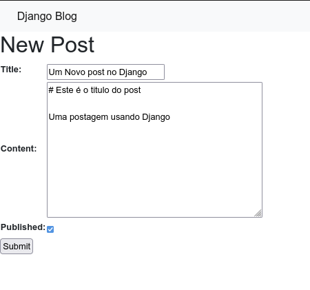
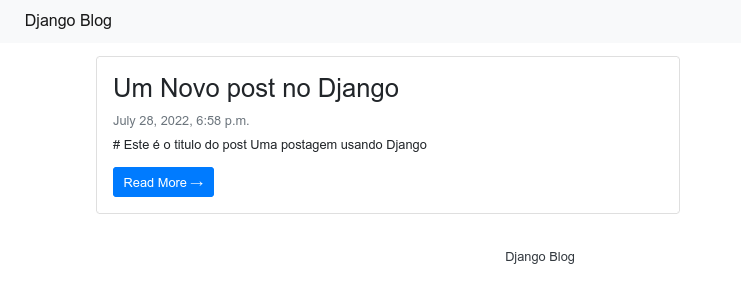
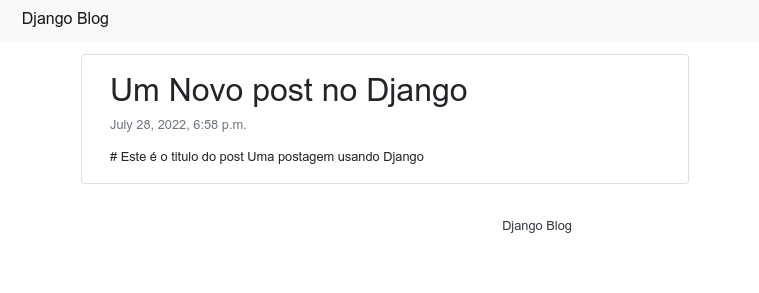
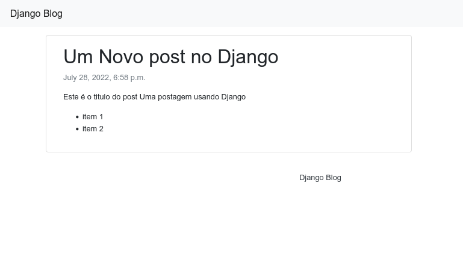

# 22 Django Models

O Django é um framework que segue um padrão de projeto conhecido como **MVT** 
Model, View, Template, teste padrão é utilizado para websites em geral e para
**APIs** o padrão seguido é geralmente o do Django Rest Framework **MVS**
Model, Viewset, Serializer.

Neste momento para nosso blog vamos focar no **MVT** e quase toda aplicação
Django nasce apartir da modelagem de dados.

## Models

Toda aplicação Django deve obrigatoriamente ter um módulo chamado **models.py** 
e neste módulo colocamos as classes que representam os dados do programa.

Usamos para isso o Django **ORM**, ferramenta integrada para mapear classes
em Python em tabelas no **SQL**.

Quando criamos o app `blog` o Django já colocou lá dentro um arquivo `models.py`
vamos começar definindo nosso model de **Post** para o blog que será bem 
parecido com o que fizemos no Flask.

`exemplos/day2/django/blog/models.py`
```python
from django.db import models


class Post(models.Model):
    title = models.CharField(max_length=255)
    slug = models.SlugField(max_length=255, unique=True)
    content = models.TextField()
    published = models.BooleanField(default=True)
    date = models.DateTimeField(auto_now_add=True)

    def __str__(self):
        return self.title

    class Meta:
        ordering = ["-date"]
```

Como pode perceber o Django já fornece os tipos necessários para criarmos o model e os seus campos e já está incluso por exemplo o `SlugField` que provê aquela lógica de transformar titulos em slug e o `DateTimeField` que já se encarrega de preencher com a data atual.

O método `__str__` é a definição do protocolo **Printable** do model e é útil para quando imprimirmos o model no terminal ou na ferramenta admin.

Repare que existe dentro da classe outra classe chamada `Meta`, esta é uma técnica chamada
de **inner class** e serve para definir um namespace de atributos separado do principal
e no caso do Django é usado para definir configurações como por exemplo a ordenação default.


## Migrations

Como estamos adicionando um novo model ao aplicativo o Django precisa criar a tabela referente no banco  de dados e para isso utilizamos as migrations.

1. Criar as instruções SQL que definem a nova tabela

```bash
django-admin makemigrations

Migrations for 'blog':
  exemplos/day2/django/blog/migrations/0001_initial.py
    - Create model Post
```

2. Aplicar as instruções criando de fato a nova tabela (outras pessoas desenvolvedoras nesse projeto só precisarão executar este comando)

```bash
django-admin migrate

Operations to perform:
  Apply all migrations: admin, auth, blog, contenttypes, sessions
Running migrations:
  Applying blog.0001_initial... OK
```

Se você quiser pode usar uma ferramenta SQLIte como a extensão do VSCode ou o SQLITE DB Browser para verificar as alterações aplicadas ao `exemplos/day2/django/db.sqlite3`

Esta é a estrutura SQL gerada pelo Django para este model.

```sql
CREATE TABLE "blog_post" (
    "id" integer NOT NULL PRIMARY KEY AUTOINCREMENT, 
    "title" varchar(255) NOT NULL, 
    "slug" varchar(255) NOT NULL UNIQUE, 
    "content" text NOT NULL, 
    "published" bool NOT NULL, 
    "date" datetime NOT NULL
)
```

Repare que a lógica para criar o `slug` e definir a `data atual` não faz parte do banco de dados, estas são operações efetuadas na camada Python antes do dado ser salvo no banco de dados.


## Shell

Uma das ferramentas mais úteis do Django é o shell administrativo

```bash
django-admin shell
>>>
```

Ele abre um terminal REPL do Python com o contexto do Django onde você pode importar os objetos do sue projeto.

Para uma experiência mais rica eu recomendo instalar o pacote `django-extensions`

```bash
pip install django-=extensions ipython ipdb
```

e coloque `django_extensions` em `INSTALLED_APPS` no `settings.py`

Que oferece uma série de utilidades interessantes, algumas delas:


### Exibir todas as URLs registradas 

```bash
django-admin show_urls

/       blog.views.view index
/<slug:slug>/   blog.views.view detail
/admin/ django.contrib.admin.sites.index        admin:index
/admin/<app_label>/     django.contrib.admin.sites.app_index    admin:app_list
/admin/<url>    django.contrib.admin.sites.catch_all_view
/admin/auth/group/      django.contrib.admin.options.changelist_view    admin:auth_group_changelist
/admin/auth/group/<path:object_id>/     django.views.generic.base.view
/admin/auth/group/<path:object_id>/change/      django.contrib.admin.options.change_view        admin:auth_group_change
/admin/auth/group/<path:object_id>/delete/      django.contrib.admin.options.delete_view        admin:auth_group_delete
/admin/auth/group/<path:object_id>/history/     django.contrib.admin.options.history_view       admin:auth_group_history
/admin/auth/group/add/  django.contrib.admin.options.add_view   admin:auth_group_add
/admin/auth/user/       django.contrib.admin.options.changelist_view    admin:auth_user_changelist
/admin/auth/user/<id>/password/ django.contrib.auth.admin.user_change_password  admin:auth_user_password_change
/admin/auth/user/<path:object_id>/      django.views.generic.base.view
/admin/auth/user/<path:object_id>/change/       django.contrib.admin.options.change_view        admin:auth_user_change
/admin/auth/user/<path:object_id>/delete/       django.contrib.admin.options.delete_view        admin:auth_user_delete
/admin/auth/user/<path:object_id>/history/      django.contrib.admin.options.history_view       admin:auth_user_history
/admin/auth/user/add/   django.contrib.auth.admin.add_view      admin:auth_user_add
/admin/autocomplete/    django.contrib.admin.sites.autocomplete_view    admin:autocomplete
/admin/jsi18n/  django.contrib.admin.sites.i18n_javascript      admin:jsi18n
/admin/login/   django.contrib.admin.sites.login        admin:login
/admin/logout/  django.contrib.admin.sites.logout       admin:logout
/admin/password_change/ django.contrib.admin.sites.password_change      admin:password_change
/admin/password_change/done/    django.contrib.admin.sites.password_change_done admin:password_change_done
/admin/r/<int:content_type_id>/<path:object_id>/        django.contrib.contenttypes.views.shortcut      admin:view_on_site
/new/   blog.views.new_post     new_post
```

### Listar as propriedades de um Model

```bash
django-admin list_model_info --model blog.Post

blog.Post
    Fields:
        id -
        title -
        slug -
        content -
        published -
        date -
    Methods (non-private/internal):
        get_next_by_date()
        get_previous_by_date()

Total Models Listed: 1
```

### Um shell com todos os objetos automaticamente importados

```bash
❯ django-admin shell_plus

# Shell Plus Model Imports
from blog.models import Post
from django.contrib.admin.models import LogEntry
from django.contrib.auth.models import Group, Permission, User
from django.contrib.contenttypes.models import ContentType
from django.contrib.sessions.models import Session
# Shell Plus Django Imports
from django.core.cache import cache
from django.conf import settings
from django.contrib.auth import get_user_model
from django.db import transaction
from django.db.models import Avg, Case, Count, F, Max, Min, Prefetch, Q, Sum, When
from django.utils import timezone
from django.urls import reverse
from django.db.models import Exists, OuterRef, Subquery
Python 3.10.5 (main, Jun  6 2022, 18:49:26) [GCC 12.1.0]
Type 'copyright', 'credits' or 'license' for more information
IPython 8.4.0 -- An enhanced Interactive Python. Type '?' for help.

In [1]: 
```

O shell é muito útil para testar querysets do Django ORM

```python
In [1]: Post.objects.all()
Out[1]: <QuerySet [<Post: Um Novo post no Django>]>

In [2]: User.objects.all()
Out[2]: <QuerySet [<User: admin>]>
```


## Views

Agora que temos uma tabela podemos partir para a próxima letra do M**V**T que são as views,
assim como no Flask, views são as funções que serão roteadas em uma URL e farão o acesso
aos models para apresentar a informação.

No django existem algumas formar de criarmos views, function based views e class based views,
vamos fazer cada uma delas para você aprender.

### Function view

A maneira clássica para criar views no Django é utilizando funções que são colocadas no arquivo `view.py` dentro do app, vamos começar criando uma view que irá expor um formulário para cadastrar posts ao blog.

`exemplos/day2/django/blog/views.py`
```python
from django.forms import ModelForm
from django.http import HttpResponseRedirect
from django.shortcuts import render
from django.urls import reverse
from django.utils.text import slugify

from blog.models import Post


class PostForm(ModelForm):
    class Meta:
        model = Post
        fields = ["title", "content", "published"]


def new_post(request):
    if request.method == "POST":
        form = PostForm(request.POST)
        if form.is_valid():
            new_post = form.save(commit=False)
            new_post.slug = slugify(new_post.title)
            new_post.save()
            return HttpResponseRedirect(reverse("index"))
    else:
        form = PostForm()

    return render(request, "new_post.html", {"form": form})
```

A view acima é responsável por criar um formulário que irá receber os novos posts e então através de um template html `new_post.html` entregar ao usuário o formulário a ser preenchido no caso de uma requisição `GET` e processar a criação do post no banco de dados no caso da requisição `POST`.

Repare que toda a lógica por trás da criação do registro no banco de dados é abstraida pelo Django.

> **OBS** já vamos criar o template em breve

#### URL

Sempre que criamos uma view no Django precisamos registrar sua URL e ao contrário do Flask onde o registro de URL fica junto da view o Django faz isso em outro arquivo, o `urls.py` na raiz do projeto.

O arquivo de URLS já tem prepopulado com as regras para a interface administrativa **que veremos em breve**

`exemplos/day2/django/djblog/urls.py`
```python
from django.contrib import admin
from django.urls import path

urlpatterns = [
    path('admin/', admin.site.urls),
]
```

E agora vamos alterar adicionando a URL para a adição de novas postagens ao blog.


`exemplos/day2/django/djblog/urls.py`
```python
from django.contrib import admin
from django.urls import path
from blog.views import new_post  # NEW

urlpatterns = [
    path('admin/', admin.site.urls),
    path('new/', new_post, name='new_post'),  # NEW
]
```

> **curiosidade** o caminho do arquivo de URLS é definido no `settings.py` na configuração `ROOT_URLCONF = 'djblog.urls'` e pode ser alterado para o caminho que preferir caso não queira usar o default.


### CBV - Class Based View

Em nossa primeira view nós criamos um redirect com `return HttpResponseRedirect(reverse("index"))`
portando agora precisamos criar uma view para este endpoint, dessa vez vamos usar uma class based view.

O Django possui uma série de classes chamadas **Views Genéricas** que atuam sobre models e facilitam 
bastante a listagem de dados e exibição de detalhes de um model.


`exemplos/day2/django/blog/views.py`
```python
from django.views.generic import ListView, DetailView
...

class PostList(ListView):
    model = Post
    template_name = "index.html"
    queryset = Post.objects.filter(published=True)


class PostDetail(DetailView):
    model = Post
    template_name = "detail.html"
```

A view `PostList` definida acima irá renderizar um template `index.html` e listar todos os `Post`s filtrados
através da **queryset** criada em `Post.objects.filter(...)`

A view `PostDetail` irá mostrar o post individual e iremos filtrar através do slug.

Essas views também precisam ser registrada no arquivo de urls.


`exemplos/day2/django/djblog/urls.py`
```python
from django.contrib import admin
from django.urls import path
from blog.views import new_post, PostList, PostDetail  # NEW

urlpatterns = [
    path('admin/', admin.site.urls),
    path('new/', new_post, name='new_post'),
    path('', PostList.as_view(), name='index'),  # NEW
    path('<slug:slug>/', PostDetail.as_view(), name='detail'),  # NEW
]
```

Repare que e url `''` será mapeada para `/` e a do detail utiliza o `slug` como padrão, o restante o Django abstrai.

## Templates

Agora que já temos **MODEL** e **VIEWS** precisamos adicionar os **T**emplates para fechar o processo.

As 3 views que criamos renderizam 3 templates

- `new_post.html` responsável por exibir o formulário
- `index.html` responsável por listar as postagens do blog
- `detailhtml` responsável por renderizar o conteúdo do post

A linguagem de templates do Django é bastante parecida com o `Jinja` que usamos no Flask, porém tem algumas
diferenças.


Primeiro precisamos dizer ao Django onde ficam os templates, para isso alteramos o `settings.py`

adicionamos a seguinte configuração logo após a definição de `BASE_DIR`

```python
TEMPLATES_DIR = BASE_DIR / 'templates'
```

Um pouco mais abaixo alteramos a configuração `TEMPLATES` adicionando `TEMPLATES_DIR` a variavel `DIRS`.


```python
TEMPLATES = [
    {
        'BACKEND': 'django.template.backends.django.DjangoTemplates',
        'DIRS': [TEMPLATES_DIR],  # NEW
    ...

```

Agora precisamos criar a pasta de templates no mesmo diretório onde está o arquivo `manage.py` e nela vamos criar os arquivos dos templates que usaremos.


```bash
mkdir exemplos/day2/django/templates
touch exemplos/day2/django/templates/{base,new_post,index,detail}.html
```


Vamos começar definindo um template `base.html` a partir de onde todos os outros irão herdar as caracteristicas principais.

`base.html`
```html
<!DOCTYPE html>
<html>

    <head>
        <title>Django Blog</title>
        <link rel="stylesheet" href="https://maxcdn.bootstrapcdn.com/bootstrap/4.0.0/css/bootstrap.min.css" />
    </head>

    <body>
        <!-- Navigation -->
        <nav class="navbar navbar-expand-lg navbar-light bg-light shadow" id="mainNav">
            <div class="container-fluid">
                <a class="navbar-brand" href="">Django Blog</a>
            </div>
        </nav>
        
        
        <footer class="py-3 bg-grey">
            <p class="m-0 text-dark text-center ">Django Blog</p>
        </footer>
    </body>
</html>
```

Agora criamos um template para permitir a adição de novos posts 

`new_post.html`

```html



  <h1>New Post</h1>

  <form action="" method="post">
    
    <table>
    {{ form.as_table }}
    </table>
    <input type="submit" value="Submit">
  </form>

```

Repare que neste template usamos `form.as_table` que vai colocar os campos do formulário todos no local correto e ainda usadmos `crsf_token` que irá colocar
um token de segurança para garantir que o envio deste formulário está sendo feito de forma segura.


Agora criamos um template `index.html` para listar os posts na página inicial do blog.

`index.html`
```html


<div class="container">
    <div class="row">
        <div class="col-md-8 mt-3 left">
            
            <div class="card mb-4">
                <div class="card-body">
                    <h2 class="card-title">{{ post.title }}</h2>
                    <p class="card-text text-muted h6">{{ post.date}} </p>
                    <p class="card-text">{{post.content|slice:":200" }}</p>
                    <a href="" class="btn btn-primary">Read More &rarr;</a>
                </div>
            </div>
            
        </div>
    </div>
</div>

```

Repare que neste template usamos `` que é o equivalente a `reverse('detail', post.slug)` e cria a URL correta para a página de detalhes.

Agora finalmente a página mais importante

`detail.html`
```html
 


<div class="container">
  <div class="row">
    <div class="col-md-8 card mb-4  mt-3 left  top">
      <div class="card-body">
        <h1> {{ object.title }} </h1>
        <p class=" text-muted"> {{ post.date }}</p>
        <p class="card-text ">{{ object.content | safe }}</p>
      </div>
    </div>
  </div>
</div>


```


Agora vamos adicionar uma postagem e ver o resultado, execute `django-admin runserver` e acesse http://127.0.0.1:8000/new/



Agora clique na barra de titulo ou acesse http://127.0.0.1:8000/ e veja





Agora clique no botão ou acesse http://127.0.0.1:8000/um-novo-post-no-django/





Pronto! nosso blog está quase 100% funcional, faltam apenas alguns detalhes :)


## Markdown

Para renderizar o conteúdo em formato Markdown precisamos instalar uma extensão no Django

https://pypi.python.org/pypi/django-markdownify

```bash
pip install django-markdownify
``` 

Agora adicionamos a extensão na configuração `settings.py` na variável `INSTALLED_APPS`

```python
INSTALLED_APPS = [
    ...
    "markdownify.apps.MarkdownifyConfig",
    "blog",
]

```

E agora alteramos o template `detail.html`


```html
 
   <!-- NEW -->


<div class="container">
  <div class="row">
    <div class="col-md-8 card mb-4  mt-3 left  top">
      <div class="card-body">
        <h1> {{ object.title }} </h1>
        <p class=" text-muted"> {{ post.date }}</p>
        <p class="card-text ">{{ object.content | markdownify }}</p>  <!-- NEW -->
      </div>
    </div>
  </div>
</div>


```

Agora sim o conteúdo em markdown será renderizado.



