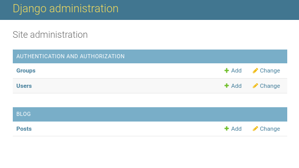
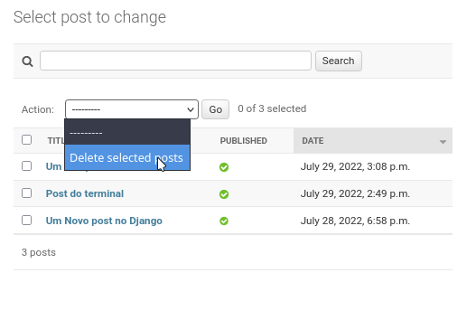
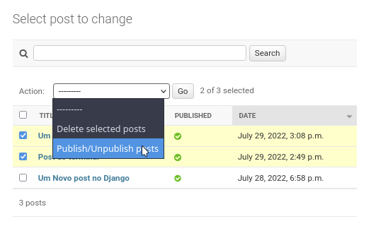

# 23 Usuário e autenticação + Admin

O Django possui um sistema de usuários que permite facilmente proteger as views com login e também tem uma interface administrativa, além disso o Django já vem com uma série de comandos administrativos para ajudar na criação de usuários.


## Criando usuários

A primeira tarefa que precisamos fazer para usar o sistema de admin e login do Django é criar um super usuário, isso pode ser feito através do terminal.

```bash
django-admin createsuperuser --username admin --email admin@blog.com
```

Este comando vai pedir para você digitar o password 2 vezes, escolha algo fácil por enquando, por exemplo: `admin`  novamente.

```bash
Password: admin
Password (again): admin 
```

O Django vai fazer algumas verificações de segurança no password mas você pode confirmat digitando `y`

```bash
The password is too similar to the username.
This password is too short. It must contain at least 8 characters.
This password is too common.
Bypass password validation and create user anyway? [y/N]: y
Superuser created successfully.
```


## Autenticação

Agora vamos aproveitar que temos um usuário e vamos proteger a nossa view `/new/` com usuário e senha.

Edite o arquivo `views.py`

```python
from django.contrib.auth.decorators import login_required
...

@login_required
def new_post(request):
    ...
```

Agora precisamos habilitar o sistema default de login alterando o arquivo `urls.py`


```python
from django.contrib import admin
from django.urls import path, include  # NEW
from blog.views import new_post, PostList, PostDetail

urlpatterns = [
    path('admin/', admin.site.urls),
    path("accounts/", include("django.contrib.auth.urls")),  # NEW
    path('new/', new_post, name='new_post'),
    path('', PostList.as_view(), name='index'),
    path('<slug:slug>/', PostDetail.as_view(), name='detail'),
]

```

E por último precisamos criar um template para a página de login

```bash
mkdir templates/registration
touch templates/registration/login.html
```

`templates/registration/login.html`
```html
 
 
<h2>Log In</h2>
<form method="post">
  
  {{ form.as_p }}
  <button type="submit">Log In</button>
</form>

```

Agora ao tentar acessar a URL http://127.0.0.1:8000/new/ acontecerá um redirecionamento para a página de login


Basta usar `admin` e `admin` que conseguirá acessar :) 


# Django Admin e Management Commands

O Django possui 2 ferramentas administrativas, os management commands e o Django Admin,
vamos ver como podemos usar cada um deles.


## Management commands

Vamos adicionar um comando que permita escrever um novo post através da linha de 
comando.

```bash
django-admin add-post --title "Titulo" --content ¨"Este é um post da linha de comando"
```

Primeiro criamos a pasta para os comandos e o caminho deve ser exatamente uma pasta chamada `management/commands` dentro da app `blog`

```bash
mkdir -p blog/management/commands
```

Também precisamos transformar `management` e `commands` em módulos Python.

```bash
touch blog/management/__init__.py
touch blog/management/commands/__init__.py
```

Agora criamos o arquivo para o nosso primeiro comando:

```bash
touch blog/management/commands/add_post.py
```

E neste arquivo escrevemos o comando:


`add_post.py`
```python
from django.core.management.base import BaseCommand, CommandError
from blog.models import Post
from django.utils.text import slugify


class Command(BaseCommand):
    """Adds new post to the database
    
    $ django-admin add_post --title "Titulo" --content "Conteudo
    """
    help = "Creates a new Post in the database"

    def add_arguments(self, parser):
        parser.add_argument("--title", type=str, required=True)
        parser.add_argument("--content", type=str, required=True)

    def handle(self, *args, **options):
        try:
            post = Post.objects.create(
                title=options["title"],
                slug=slugify(options["title"]),
                content=options["content"],
            )
        except Exception as e:
            raise CommandError(e)
        else:
            self.stdout.write(self.style.SUCCESS(f"Post {post.title} created."))
```


Agora verá o comando disponível

```
django-admin --help    

Type 'django-admin help <subcommand>' for help on a specific subcommand.

Available subcommands:

...

[blog]
    add_post

...
``` 

E pode utilizar


```bash
django-admin add_post --title "Post do terminal" --content "Postagem bem legal no terminal" 
Post "Post do terminal" created
```

Acesse o blog http://127.0.0.1:8000/ e verá a postagem publicada.


## Interface Admin

O Admin é a principal ferramenta e talvez o motivo de muitas pessoas escolherem o Django, esta interface já vam habilidade por default e pode ser acessada em http://127.0.0.1:8000/admin/ usando a conta de superuser `admin, admin`


Por default apenas os models referentes ao controle de usuários é ativado no admin, para adicionar os outros models precisamos alterar o arquivo `admin.py` dentro de cada app.


`blog/admin.py`

```python
from django.contrib import admin

from blog.models import Post


class PostAdmin(admin.ModelAdmin):
    list_display = ["title", "published", "date"]
    list_filter = ["published", "date"]
    search_fields = ["title", "content"]
    prepopulated_fields = {"slug": ("title",)}
    ordering = ["-date"]


admin.site.register(Post, PostAdmin)

```

Agora pode dar o refresh na página http://127.0.0.1:8000/admin/ e verá a app blog listada




E através do admin podemos adicionar novos posts, alterar e deletar, experimente.


Ao listar todos os posts repare que tem um dropdown **action** que permite deletar vários posts selecionados



Podemos adicionar outras actions para serem aplicadas a todos os itens selecionados, por exemplo, para alterar o
status de publicado/não publicado.


`admin.py`
```python

class PostAdmin(admin.ModelAdmin):
    ...
    actions = ["publish"]

    @admin.action(description="Publish/Unpublish posts")
    def publish(self, request, queryset):
        for post in queryset:
            post.published = not post.published
            post.save()
```





## Conclusão

O Django é um dos frameworks mais produtivos pelo fato de entregar muitas coisas prontas e também o mais utilizado em grandes projetos por ser bastante suportado pela comunidade.

O Django é uma ótima opção para sites de gerenciamento de conteúdo (CMS) que usem banco de dados relacional (SQL).

Em um próximo capitulo do treinamento vamos fazer um projeto completo, mas será usando o FastAPI e o motivo de usa-lo é o fato dele não abstrair tantas coisas e de fato podermos aprender sem ter as mágicas do Django escondendo a implementação.
